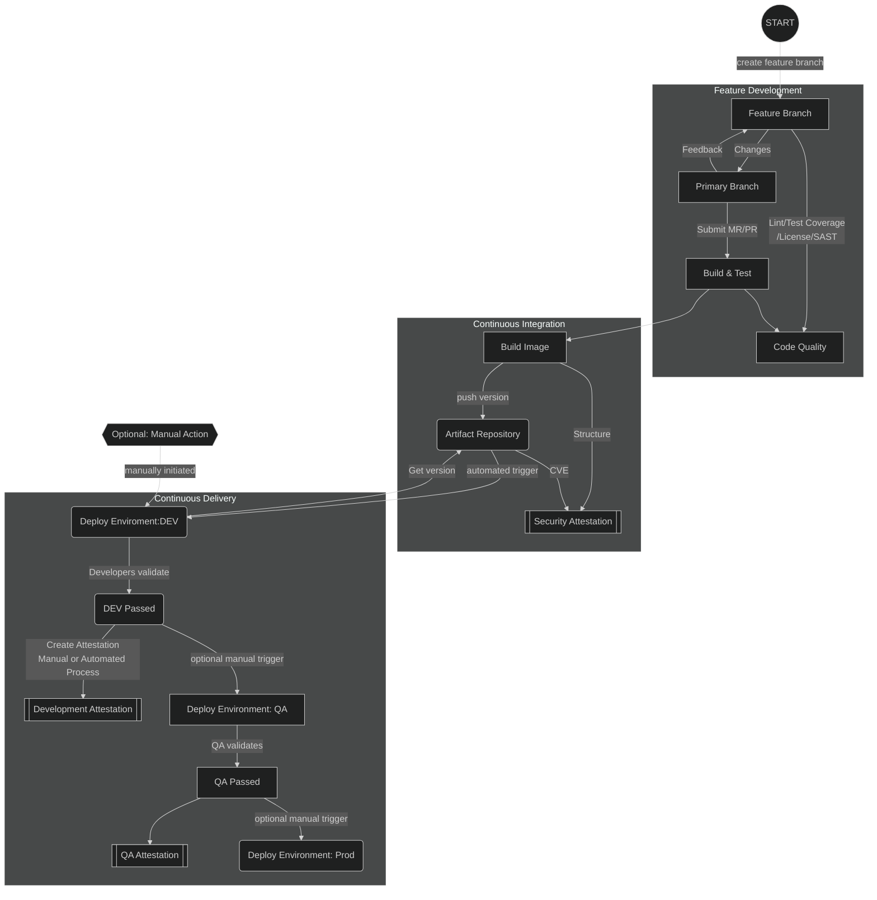

# Overview

The purpose of this repository is to demonstrate best practices for securing a CICD pipeline.

This repository addresses multiple layers to apply different techniques for securing a pipeline. The emphasis is on the tools and methods that can be applied onto or within a CICD pipeline and should not be used as the sole security measure, but applied along-side a comprehensive security strategy.

## CICD Pipeline



## Requirements

* **GCP Project ID** where the project has an active billing account associated with it
* `gcloud` CLI installed, authorized and setup to use selected project ID
* Terraform 0.12.x

## Binary Authorization CICD Flow

[Sequence Diagram](docs/BINARY_AUTHORIZATION.md)

# Running

1. Setup the Infrastructure (manually)
    1. `cd terraform`
    1. `terraform init`
    1. `terraform plan -out tfplan`
    1. `terraform apply tfplan`

    > NOTE the first run **MAY** fail due to eventual consistency with enabling APIs.  Just re-run if you see an error similar to this: "api not enabled, if it was just enabled, wait for a few minutes". Future updates may fix this.

1. Add your name to the `src/main.go` in place of "Mike". Here's an example:
    ```golang
        func SayHelloHandler(w http.ResponseWriter, r *http.Request) {
            var output strings.Builder
            //...omitted for clarity
            //...
            output.WriteString("<h1>Hi Mike!</h1>") // ##_CHANGE ME_##
            //...
            //...omitted for clarity
        }
    ```

1. Update the unit test `src/main_test.go` in place of "Mike". Here's an example:
    ```golang
        func TestHello(t *testing.T) {
            //...omitted for clarity
            //...
            expected := `Hi Mike!` // ##_CHANGE ME_##

            result := rr.Body.String()

            if !strings.ContainsAny(result, expected) {
                t.Errorf("handler returned unexpected body: got %v want %v",
                    rr.Body.String(), expected)
            }
        }
    ```

1. Commit and push changes to the repository
    1. `git commit -a -m 'personalizing the app' && git push -u origin master`

1. Watch the [CI/CD Pipeline](-/pipelines) from within Gitlab

1. Approve "Security", "Development", "QA" stages of the build

## Setting up CI

The jobs are configured to run based on the infrastructure created. CICD pipeline follows the above flow-diagram.

## Running CI

The CI needs to utilize thg Google Service Account (GSA) created in the infrastructure/terraform **BEFORE** running the CICD job is run (pre-check on CICD is enabled to avoid false-negative builds)

### Setting up the Infrastructre

There are two CI/CD variables used in the pipeline:  `GOOGLE_BUILD_GSA` and `GOOGLE_PROJECT_ID`

1. Fork this repository (fork, not clone so you run in your own CICD space)
    * CICD needs to be enabled and configured for running within Gitlab (this short tutorial assumes this has been completed)
1. Goto the "Admin -> CI / CD" configuration for the repository
1. Click on "Expand" on the "Variables" section
1. Click on "Add Variable"
1. Name the variable "GOOGLE_BUILD_GSA"
1. Paste the contents of this command exactly: `gcloud secrets versions access 1 --secret="cicd-build-gsa-key"`
    * Select "Mask Variable" to have the use of this variable masked during CI/CD job execution
1. Click Add Variable.
1. Repeat "Add Variable" for "GOOGLE_PROJECT_ID"
    * If unknown, find the value of your active project: `gcloud config list --format='value(core.project)'`
1. Once verified both GOOGLE_BUILD_GSA and GOOGLE_PROJECT_ID are created, continue
1. Run the CICD Pipeline by making a change to the code or manually triggering via "CI/CD > Run Pipeline > Run"

# Signed Git Commits

This project is setup to ensure all commits are signed using GPG [as described in this documentation](https://gitlab.com/help/user/project/repository/gpg_signed_commits/index.md).

### Commit Format

```bash
git commit -a -S -m 'Signed commit'
# supply passphrase if needed (recommend setting up a passphrase)
```

# Resource Usage

This repository creates 3 GKE instances, creates a GCLB Ingress, utilizes KMS keys for the attestors, a Secret in the Secrets Manager and a small set of other infrastructure related to the project.

:warning: This project will **NOT** run within the "free-tier" for GCP, but if run in isolation and at short periods at a time, the costs should be very minimal

:warning: Each instance is a small GKE instance and are **NOT** intended to be ready for production. The purpose is to demonstrate a deployment sequence, NOT how to configure GKE clusters


# Logging / Metrics

Logging is automatically pulled into Stackdrive. The policy for Binary Authorization is configured to log/audit and deny when attestations are not present. An additional exercise can setup a custom metric and report on failed attestation assertions.

Creating a metric for the number of denied containers due to the policy can be created using the following formula in Stackdriver:

```json
resource.type="k8s_cluster"
resource.labels.location="us-central1-a"
resource.labels.cluster_name="bin-auth-dev"
log_name="projects/[PROJECT_ID]/logs/events"
jsonPayload.reason="FailedCreate"
jsonPayload.kind="Event"
jsonPayload.message=~"image policy webhook backend denied one or more images" AND NOT "(combined from similar events)"
```

    > :warning: NOTE, replace [PROJECT_ID] with the real Google project ID. The "location" and "cluster_name" are defaults for this project, change as needed to accommodate the appropriate cluster

Once the logs are visible, select "Create Metric" and fill in the relevant information and save.  Allow time for the metrics to be counted/indexed (up to 24h). During this time, create an Alert based on the metric for a reasonable amount of failure.