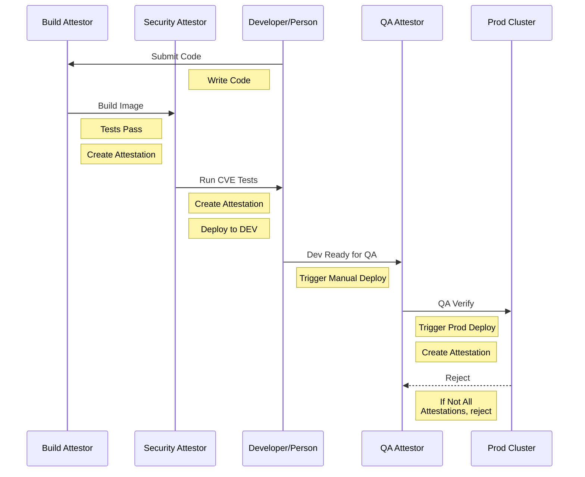

# Overview

The purpose of this repository is to demonstrate a CICD flow using a build-up of Binary Authorization Attestations with multiple Attestors

## Requirements

* GCP Project ID where the project has an active billing account associated with it
* `gcloud` CLI installed, authorized and setup to use selected project ID
* Terraform 0.12+

## Binary Authorization CICD Flow



# Running

1. Setup the Infrastructure (manually)
    1. `cd terraform`
    1. `terraform init`
    1. `terraform plan -out tfplan`
    1. `terraform apply tfplan`

    > NOTE the first run **MAY** fail due to eventual consistency with enabling APIs.  Just re-run if you see an error similar to this: "api not enabled, if it was just enabled, wait for a few minutes". Future updates may fix this.

1. Add your name to the `src/main.rs` in place of "World". Here's an example:
    ```rust
    #[get("/")]
    fn hello() -> &'static str {
        "Hello, Mike!"
    }
    ```

1. Commit and push changes to the repository
    1. `git commit -a -m 'personalizing the app' && git push -u origin master`

1. Watch the CI/CD Pipeline from within Gitlab


## Setting up CI

The jobs are configured to run based on the infrastructure created. CICD pipeline follows the above flow-diagram.

## Running CI

The CI needs to utilize thg Google Service Account (GSA) created in the infrastructure/terraform **BEFORE** running the CICD job is run (pre-check on CICD is enabled to avoid false-negative builds)

### Setting up the CICD Variables

There are two CI/CD variables used in the pipeline:  GOOGLE_BUILD_GSA and GOOGLE_PROJECT_ID

1. Fork this repository (fork, not clone so you run in your own CICD space)
    * CICD needs to be enabled and configured for running within Gitlab (this short tutorial assumes this has been completed)
1. Goto the "Admin -> CI / CD" configuration for the repository
1. Click on "Expand" on the "Variables" section
1. Click on "Add Variable"
1. Name the variable "GOOGLE_BUILD_GSA"
1. Paste the contents of this command exactly: `gcloud secrets versions access 1 --secret="cicd-build-gsa-key"`
    * Select "Mask Variable" to have the use of this variable masked during CI/CD job execution
1. Click Add Variable.
1. Repeat "Add Variable" for "GOOGLE_PROJECT_ID"
    * If unknown, find the value of your active project: `gcloud config list --format='value(core.project)'`
1. Once verified both GOOGLE_BUILD_GSA and GOOGLE_PROJECT_ID are created, continue
1. Run the CICD Pipeline by making a change to the code or manually triggering via "CI/CD > Run Pipeline > Run"

# Resource Usage

This repository creates 3 GKE instances, utilizes KMS keys for the attestors, a Secret in the Secrets Manager and a small set of other infrastructure related to the project.

    > :warning: DO NOT assume this project can run under the "free-tier" for GCP, but if run in isolation and at short periods at a time, the costs should be very minimal

    > :warning: Each instance is a small GKE instance and are **NOT** intended to be ready for production.  The purpose is to demonstrate a deployment sequence, NOT how to configure GKE clusters


# Logging / Metrics

Creating a metric for the number of denied containers due to the policy can be created using the following formula in Stackdriver:

```json
resource.type="k8s_cluster"
resource.labels.location="us-central1-a"
resource.labels.cluster_name="bin-auth-dev"
log_name="projects/[PROJECT_ID]/logs/events"
jsonPayload.reason="FailedCreate"
jsonPayload.kind="Event"
jsonPayload.message=~"image policy webhook backend denied one or more images" AND NOT "(combined from similar events)"
```

    > :warning: NOTE, replace [PROJECT_ID] with the real Google project ID. The "location" and "cluster_name" are defaults for this project, change as needed to accommodate the appropriate cluster

Once the logs are visible, select "Create Metric" and fill in the relevant information and save.  Allow time for the metrics to be counted/indexed (up to 24h). During this time, create an Alert based on the metric for a reasonable amount of failure.