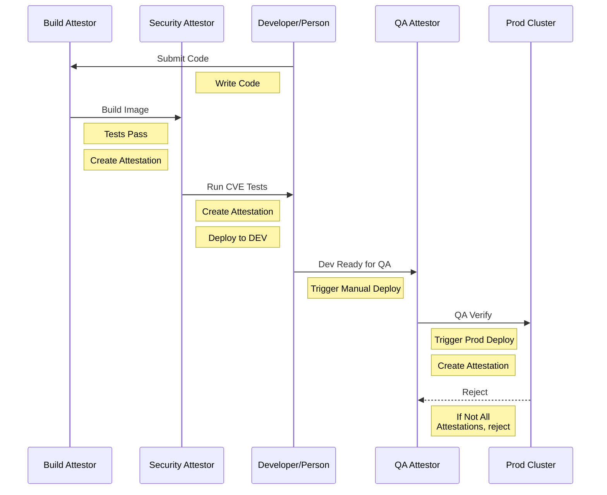

# Overview

The purpose of this repository is to demonstrate a CICD flow using a build-up of Binary Authorization Attestations with multiple Attestors

## Requirements

* GCP Project ID where the project has an active billing account associated with it

## Resource Usage

This repository creates 3 GKE instances.  Each instance is a small GKE instance and are **NOT** intended to be ready for production.  The purpose is to demonstrate a deployment sequence, NOT how to configure GKE clusters

## Flow

