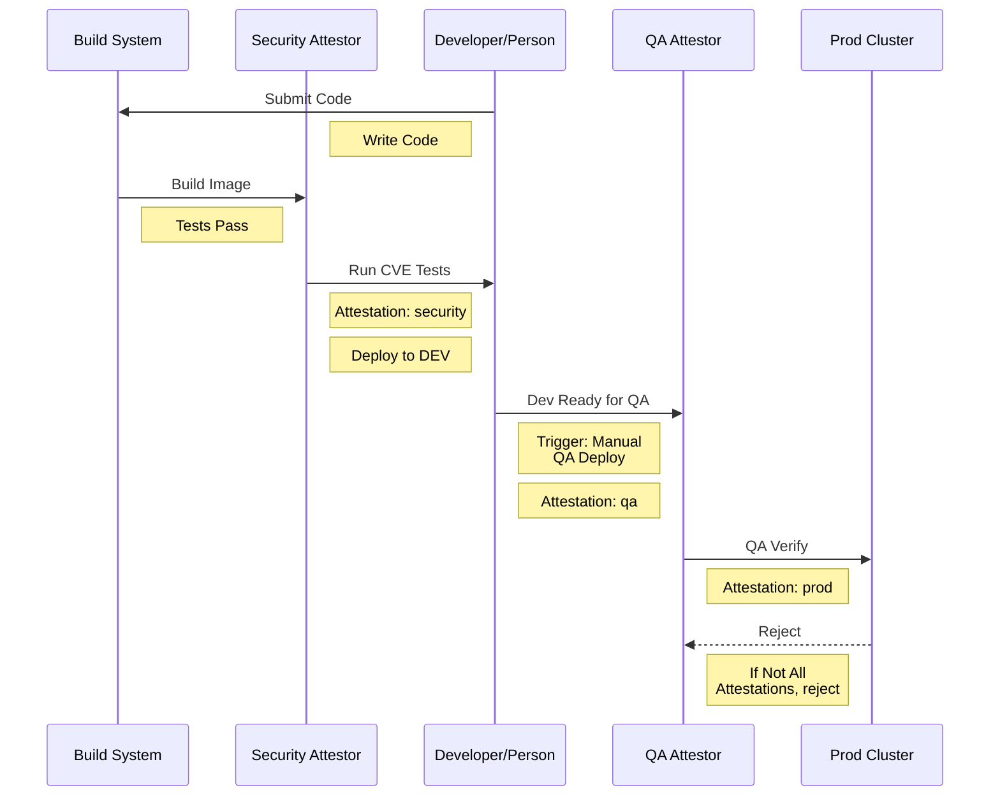

## Binary Authorization CICD Flow

```mermaid
sequenceDiagram
    participant B as Build System
    participant S as Security Attestor
    participant D as Developer/Person
    participant Q as QA Attestor
    participant P as Prod Cluster

    D->>B: Submit Code
    Note left of D: Write Code

    B->>S: Build Image
    Note right of B: Tests Pass

    S->>D: Run CVE Tests
    Note right of S: Attestation: security
    Note right of S: Deploy to DEV

    D->>Q: Dev Ready for QA
    Note right of D: Trigger: Manual<br/>QA Deploy
    Note right of D: Attestation: qa

    Q->>P: QA Verify
    Note right of Q: Attestation: prod

    P-->>Q: Reject
    Note right of Q: If Not All<br/>Attestations, reject
```