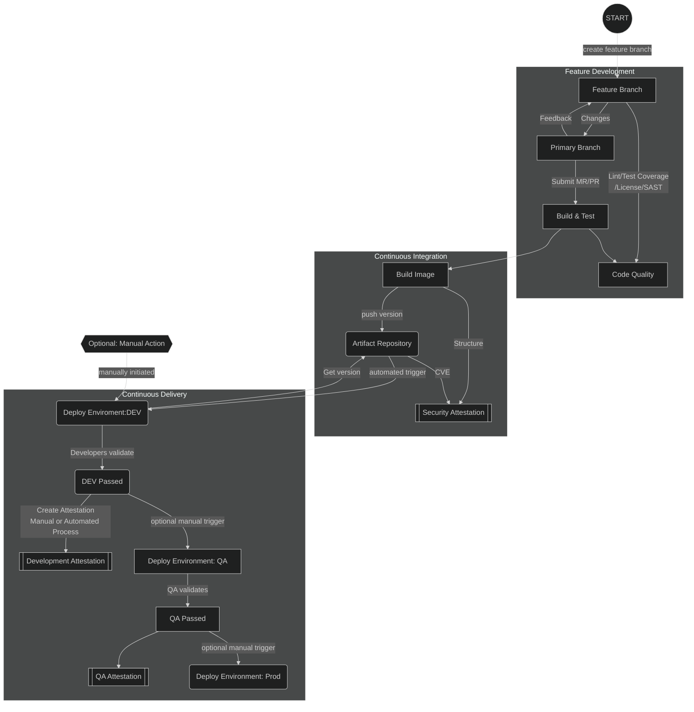

# CICD Pipeline

```mermaid
%%{init: { 'theme': 'dark' } }%%
graph TD

  FR[Feature Branch]
  CODECHECK[Code Quality]
  PRI[Primary Branch]
  SECURITY[[Security Attestation]]
  BUILD[Build & Test]
  IMG[Build Image]
  AR[Artifact Repo]

  START((START)) -->|create feature branch| FR

  subgraph CODE [Feature Development]
    FR -->|"Lint/Test Coverage<br/>/License/SAST"| CODECHECK
    FR -->|Changes| PRI
    PRI -->|Feedback| FR
    PRI -->|Submit MR/PR| BUILD
    BUILD --> CODECHECK
  end

  subgraph CI [Continuous Integration]
    BUILD --> IMG
    IMG -->|Structure| SECURITY
    IMG -->|push version| AR(Artifact Repository)
    AR -->|CVE| SECURITY
  end

  AR -->|automated trigger| DEV
  MANUAL{{Optional: Manual Action}} -->|manually initiated| DEV

  subgraph CD [Continuous Delivery]
    DEV(Deploy Enviroment:DEV) -->|Get version| AR
    DEV -->|Developers validate| DEV_OK(DEV Passed)
    DEV_OK -->|"Create Attestation<br/>Manual or Automated Process"| DEV_ATT[[Development Attestation]]
    DEV_OK -->|optional manual trigger| QA
    QA[Deploy Environment: QA] -->|QA validates| QA_OK(QA Verified)
    QA_OK[QA Verified] --> QA_ATT[[QA Attestation]]
    QA_OK[QA Passed] -->|optional manual trigger| PROD(Deploy Environment: Prod)
  end

```
